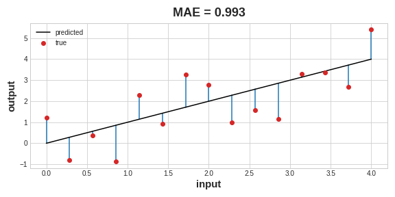
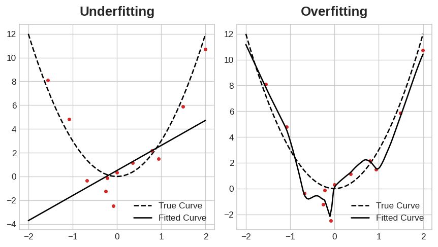

# Part 2: Fundamentals of Deep Learning with Keras

**Objective:** This reading introduces the core concepts of deep learning and provides a practical guide to building, training, and evaluating neural networks using the Keras library. We will focus on a regression task as a running example, implementing the workflow step-by-step.

---

## I. Introduction to Deep Learning & Frameworks

**1.1 What is Deep Learning (DL)?**

Deep Learning is a subfield of machine learning based on artificial neural networks with multiple layers (hence "deep"). Unlike traditional machine learning algorithms that often require manual feature engineering (where domain experts define the most relevant input variables), deep learning models aim to automatically learn hierarchical representations of data.

Starting from raw input, each successive layer learns increasingly complex features. For example, in image recognition, initial layers might detect simple edges, subsequent layers might combine edges to recognize shapes, and deeper layers might identify objects based on these shapes. This ability to learn features automatically makes DL particularly powerful for complex tasks involving unstructured data like images, text, and audio.

**1.2 Key Deep Learning Libraries**

Several software libraries facilitate the development of deep learning models. Two prominent ones are:

*   **TensorFlow & Keras:**
    *   **TensorFlow:** Developed by Google, TensorFlow is a powerful open-source library for numerical computation and large-scale machine learning. It provides low-level APIs for fine-grained control but can be complex for beginners.
    *   **Keras:** Keras is a high-level API for building and training neural networks. It emphasizes user-friendliness, modularity, and rapid experimentation. Keras can run on top of different backends, including TensorFlow (most common), Theano, or CNTK. We will use the `tensorflow.keras` implementation. Its ease of use makes it an excellent choice for both beginners and practitioners needing fast prototyping and deployment.

*   **PyTorch:**
    *   Developed by Facebook's AI Research lab (FAIR), PyTorch is another major open-source library. It is widely adopted, especially in the research community, and is known for its Pythonic feel, flexibility, and dynamic computation graphs (allowing network structure changes during runtime).

**Focus:** This summary will utilize **Keras (specifically `tensorflow.keras`)** for all practical examples due to its clear syntax and streamlined workflow for common tasks.

---

## II. Core Concepts: Building Blocks of Neural Networks

Before building models, understanding the fundamental components is essential.

**2.1 Neurons and Layers**

*   **Neuron (or Unit):** The basic computational unit in a neural network. It receives one or more inputs, performs a weighted sum of these inputs, adds a bias term, and then passes the result through an **activation function**.
*   **Layer:** Neurons are organized into layers. Common types include:
    *   **Input Layer:** The first layer, which receives the raw input data (features). The number of neurons typically corresponds to the number of features in the dataset.
    *   **Hidden Layers:** Layers between the input and output layers. These layers perform the intermediate computations and feature extraction. A network can have zero, one, or multiple hidden layers.
    *   **Output Layer:** The final layer, which produces the network's prediction. The number of neurons and the activation function depend on the type of task (e.g., one neuron with linear activation for regression, multiple neurons with softmax activation for multi-class classification).

**2.2 MLP vs. DNN**

These terms are often encountered and sometimes used interchangeably, but there's a distinction:

*   **MLP (Multilayer Perceptron):** Refers to a specific class of feedforward neural networks. Key characteristics include:
    *   An input layer, one or more hidden layers, and an output layer.
    *   All layers are **fully connected** (or **Dense**), meaning each neuron in one layer connects to every neuron in the next layer.
    *   Typically use non-linear activation functions in the hidden layers.

*   **DNN (Deep Neural Network):** A broader term referring to any neural network architecture with **multiple hidden layers** (conventionally, two or more).

**Relationship Summary:**

| Term         | Meaning                                                                      | Connection Type          | Depth Requirement   |
| :----------- | :--------------------------------------------------------------------------- | :----------------------- | :------------------ |
| **MLP**      | Specific architecture: fully connected layers.                               | Fully Connected (Dense)  | ≥ 1 hidden layer    |
| **DNN**      | General term: any network with multiple hidden layers.                       | Can be Dense, Conv, RNN etc. | ≥ 2 hidden layers |
| **Deep MLP** | An MLP with 2 or more hidden layers. It *is* a type of DNN.                  | Fully Connected (Dense)  | ≥ 2 hidden layers |
| **CNN / RNN**| Networks using Convolutional or Recurrent layers. Also DNNs if deep (≥2 layers). | Convolutional/Recurrent | Often ≥ 2 layers    |

**Key Takeaway:** All MLPs with two or more hidden layers qualify as DNNs. However, not all DNNs are MLPs, as DNNs can incorporate other specialized layer types (like Convolutional or Recurrent layers) suitable for specific data structures.

**2.3 What Makes a Network "Deep"?**

The term "deep" generally implies the presence of **two or more hidden layers**. The depth allows the network to learn a hierarchy of features, progressively building more complex concepts from simpler ones learned in earlier layers. This hierarchical feature learning is a key reason for the success of deep learning on complex problems.

**2.4 How Many Neurons per Layer?**

Determining the optimal number of neurons (or units) in each hidden layer is more of an art than a science, often requiring experimentation. There's no single formula. Considerations include:

*   **Task Complexity:** More complex problems might benefit from more neurons or layers.
*   **Dataset Size:** Larger datasets can often support larger networks without overfitting.
*   **Input Features:** The dimensionality of the input data can be a starting point, but hidden layers often have different sizes.
*   **Computational Resources:** More neurons mean more parameters, requiring more memory and longer training times.
*   **Overfitting Risk:** Too many neurons can lead to the model memorizing the training data (overfitting) instead of learning generalizable patterns.

**General Heuristics (Starting Points):**

*   **Powers of 2:** Common choices are 32, 64, 128, 256, 512, etc., partly for computational efficiency.
*   **Funnel Structure:** Often, the number of neurons decreases in successive hidden layers (e.g., Input -> 128 -> 64 -> Output).
*   **Simple Problems/Tabular Data:** Hidden layers might range from tens (e.g., 16, 32) to a few hundred neurons (e.g., 64, 128).
*   **Complex Problems (e.g., Image Models):** Later fully connected layers in models like CNNs might have 512, 1024, or more neurons.

**Recommendation:** Start with a relatively simple architecture (e.g., 1-2 hidden layers with moderate neurons like 64 or 32) and gradually increase complexity if performance is insufficient, while monitoring for overfitting.

**2.5 Activation Functions**

Activation functions introduce non-linearity into the network. Without them, stacking multiple linear layers would be mathematically equivalent to a single linear layer, severely limiting the model's ability to learn complex patterns.

**Common Choices and Use Cases:**

*   **ReLU (Rectified Linear Unit):**
    *   *Function:* `f(x) = max(0, x)`
    *   *Use Case:* Most common choice for **hidden layers**. Computationally efficient and helps mitigate the vanishing gradient problem.
    *   *Output Range:* \[0, ∞)
*   **Linear (or 'None'):**
    *   *Function:* `f(x) = x`
    *   *Use Case:* Typically used in the **output layer for regression tasks**, where the prediction needs to be a continuous value without constraints.
    *   *Output Range:* (-∞, ∞)
*   **Sigmoid:**
    *   *Function:* `f(x) = 1 / (1 + exp(-x))`
    *   *Use Case:* Primarily used in the **output layer for binary classification tasks**. Outputs a probability between 0 and 1. Less common in hidden layers now compared to ReLU.
    *   *Output Range:* (0, 1)
*   **Softmax:**
    *   *Function:* Converts a vector of values into a probability distribution (values sum to 1).
    *   *Use Case:* Used in the **output layer for multi-class classification tasks**. Each neuron's output represents the probability of the input belonging to that specific class.
    *   *Output Range:* Vector where each element is \[0, 1] and the sum is 1.
*   **Tanh (Hyperbolic Tangent):**
    *   *Function:* `f(x) = tanh(x)`
    *   *Use Case:* Sometimes used in hidden layers. Similar to Sigmoid but zero-centered.
    *   *Output Range:* (-1, 1)

**2.6 Parameters vs. Hyperparameters**

It's crucial to distinguish between these two types of settings:

*   **Parameters:** These are the values the model **learns** during the training process. They are internal to the model and are adjusted by the optimization algorithm to minimize the loss function.
    *   *Examples:* Weights (connections between neurons) and biases (terms added at each neuron).
*   **Hyperparameters:** These are configuration settings specified **before** the training process begins. They define the model's architecture and control how the training proceeds. They are *not* learned from the data directly but are set by the user/developer. Finding good hyperparameters often involves experimentation (hyperparameter tuning).
    *   *Examples:*
        *   Number of hidden layers
        *   Number of neurons per layer
        *   Choice of activation functions
        *   Choice of `optimizer` (e.g., 'adam', 'sgd', 'rmsprop')
        *   `learning rate` (controls how much parameters are adjusted in each step)
        *   Choice of `loss` function
        *   `batch_size` (number of samples processed per parameter update)
        *   `epochs` (number of full passes over the training dataset)
        *   Regularization techniques and their settings (e.g., dropout rate, parameters for early stopping)

---

## III. Practical Deep Learning with Keras: A Regression Example

Let's apply these concepts to build and train a neural network using Keras. We will perform a regression task: predicting a continuous value. We will use the "Cereal" dataset (predicting cereal rating based on nutritional info) as the primary example. This section directly mirrors Activity 2, Part 1.

**3.1 Step 1: Setup & Environment**

First, import the necessary libraries. Ensure you have `tensorflow` and `scikit-learn` installed (`pip install tensorflow scikit-learn pandas matplotlib`).

```python
# --- Essential Libraries ---
import numpy as np # For numerical operations
import pandas as pd # For data loading and manipulation (DataFrames)
import matplotlib.pyplot as plt # For plotting graphs

# --- Scikit-learn ---
# For splitting data into training and testing sets
from sklearn.model_selection import train_test_split

# --- TensorFlow and Keras ---
import tensorflow as tf # Base library (Keras is integrated)
from tensorflow.keras import Sequential # Model type for linear stack of layers
from tensorflow.keras.layers import Dense, Input # Core layer types
# Note: Input can be used explicitly or implicitly via input_shape in the first layer

# Set random seed for reproducibility (optional but recommended)
np.random.seed(42)
tf.random.set_seed(42)

print("Libraries imported successfully.")
```

**3.2 Step 2: Data Preparation**

We need to load the data, separate it into input features (X) and the target variable (y), and then split it into training and testing sets.

*   **Load Data:** We use `pandas.read_csv` to load data directly from URLs.

    ```python
    # Load the Cereal dataset
    cereal_url = "https://github.com/ML-Course-2025/session5/raw/refs/heads/main/material/datasets/cereal.csv"
    cereal_data = pd.read_csv(cereal_url)
    print("Cereal dataset loaded. Shape:", cereal_data.shape)
    # Display first few rows to inspect
    # print(cereal_data.head())

    # Alternative: Load the Concrete dataset
    # concrete_url = "https://github.com/ML-Course-2025/session5/raw/refs/heads/main/material/datasets/concrete.csv"
    # concrete_data = pd.read_csv(concrete_url)
    # print("\nConcrete dataset loaded. Shape:", concrete_data.shape)
    # print(concrete_data.head())
    ```

*   **Separate Features (X) and Target (y):**
    The features are the input columns used for prediction. The target is the column we want to predict.

    ```python
    # For Cereal dataset: Predict 'rating' based on nutritional info
    cereal_features = cereal_data[['calories', 'protein', 'fat', 'sodium', 'fiber', 'carbo', 'sugars', 'potass', 'vitamins']]
    cereal_target = cereal_data['rating']
    print(f"Cereal Features (X) shape: {cereal_features.shape}")
    print(f"Cereal Target (y) shape: {cereal_target.shape}")

    # Example for Concrete dataset (if used): Predict 'CompressiveStrength'
    # concrete_features = concrete_data.drop(columns=['CompressiveStrength'])
    # concrete_target = concrete_data['CompressiveStrength']
    # print(f"Concrete Features (X) shape: {concrete_features.shape}")
    # print(f"Concrete Target (y) shape: {concrete_target.shape}")
    ```

*   **Split Data into Training and Testing Sets:**
    We train the model on the training set and evaluate its performance on the unseen testing set to gauge generalization ability. `train_test_split` handles this.

    ```python
    # Using Cereal data
    cereal_X_train, cereal_X_test, cereal_y_train, cereal_y_test = train_test_split(
        cereal_features,
        cereal_target,
        test_size=0.2,    # 20% of data for testing, 80% for training
        random_state=42   # Ensures the split is the same every time (reproducibility)
    )

    print(f"Cereal Training Features shape: {cereal_X_train.shape}")
    print(f"Cereal Testing Features shape: {cereal_X_test.shape}")
    print(f"Cereal Training Target shape: {cereal_y_train.shape}")
    print(f"Cereal Testing Target shape: {cereal_y_test.shape}")

    # Split for Concrete data (if used)
    # concrete_X_train, concrete_X_test, concrete_y_train, concrete_y_test = train_test_split(
    #     concrete_features, concrete_target, test_size=0.2, random_state=42)
    ```
    *Data Preprocessing Note:* For many real-world datasets, additional steps like handling missing values and feature scaling (e.g., using `StandardScaler` from scikit-learn) are crucial before feeding data into a neural network. We omit scaling here for simplicity, but it's highly recommended in practice.

**3.3 Step 3: Defining the Model Architecture**

We will use the Keras `Sequential` API, which is suitable for models where layers are stacked linearly.

*   **Instantiate the Model:** Create an empty `Sequential` model.
*   **Add Layers:**
    *   Use `Input(shape=...)` or specify `input_shape` in the first layer to define the expected shape of the input data (excluding the batch size). `cereal_X_train.shape[1]` gives the number of features.
    *   Add `Dense` layers for fully connected connections. Specify the number of neurons (units) and the `activation` function.
    *   The final `Dense` layer for this regression task has 1 unit and uses the default linear activation.

```python
# Define the model architecture
model = Sequential(name="Cereal_Rating_Predictor")

# Add the Input layer implicitly via input_shape in the first Dense layer
# The shape is a tuple: (number_of_features,)
num_features = cereal_X_train.shape[1]
model.add(Dense(64, activation='relu', input_shape=(num_features,), name="Hidden_Layer_1"))

# Alternatively, define Input layer explicitly:
# model.add(Input(shape=(num_features,), name="Input_Layer"))
# model.add(Dense(64, activation='relu', name="Hidden_Layer_1"))

# Add another hidden layer
model.add(Dense(32, activation='relu', name="Hidden_Layer_2"))

# Add the output layer (1 neuron for regression, linear activation is default)
model.add(Dense(1, name="Output_Layer"))

# Print a summary of the model's layers and parameters
print("\nModel Architecture Summary:")
model.summary()
```

The `model.summary()` output shows each layer, its output shape, and the number of trainable parameters (weights and biases).

*   **Other Keras Layer Types (Brief Mention):** Keras offers a wide variety of layers for different purposes:
    *   `Conv2D`, `MaxPooling2D`, `AveragePooling2D`: For Convolutional Neural Networks (CNNs), typically used for image data.
    *   `LSTM`, `GRU`: For Recurrent Neural Networks (RNNs), suitable for sequential data like text or time series.
    *   `Flatten`: Reshapes multi-dimensional input (e.g., from CNN layers) into a 1D vector, often used before feeding into `Dense` layers.
    *   `Dropout`: A regularization technique that randomly sets a fraction of input units to 0 during training to prevent overfitting.
    *   `BatchNormalization`: Helps stabilize and accelerate training by normalizing activations within layers.

**3.4 Step 4: Compiling the Model**

Before training, the model needs to be configured for the learning process. This is done using the `compile` method, which requires specifying:

*   **`optimizer`:** The algorithm used to update the model's parameters (weights and biases) based on the gradients of the loss function.
    *   `'adam'` (Adaptive Moment Estimation) is a popular and generally effective default choice. It adapts the learning rate during training. Other options include `'sgd'` (Stochastic Gradient Descent), `'rmsprop'`. The `learning rate` is a critical hyperparameter often tuned within the optimizer.
*   **`loss`:** The function used to measure how well the model is performing on the training data. The goal of training is to minimize this function.
    *   `'mean_squared_error'` (MSE) is standard for regression tasks. It calculates the average of the squared differences between predicted and actual values.
    *   Other options: `'mean_absolute_error'` (MAE), `'binary_crossentropy'` (for binary classification), `'categorical_crossentropy'` (for multi-class classification).
*   **`metrics`:** A list of metrics used to monitor the model's performance during training and evaluation. These are not used for optimization but provide additional insights.
    *   `['mae']` (Mean Absolute Error) is often used alongside MSE for regression. MAE calculates the average of the absolute differences and is interpretable in the same units as the target variable.





```python
# Compile the model
model.compile(optimizer='adam',
              loss='mean_squared_error', # Loss function for regression
              metrics=['mae'])           # Metric to monitor (Mean Absolute Error)

print("\nModel compiled successfully.")
```

**3.5 Step 5: Training the Model**

Now we train the model using the `fit` method, providing the training data and specifying training configurations.

```python
# Define training hyperparameters
epochs = 50        # Number of passes through the entire training dataset
batch_size = 16    # Number of samples per gradient update

print(f"\nStarting model training for {epochs} epochs with batch size {batch_size}...")

# Train the model
# The 'fit' method returns a History object containing training metrics
history_cereal = model.fit(
    cereal_X_train,              # Training features
    cereal_y_train,              # Training target
    epochs=epochs,               # Number of epochs
    batch_size=batch_size,       # Batch size
    validation_data=(cereal_X_test, cereal_y_test), # Data for evaluating performance on unseen data after each epoch
    verbose=1                    # Show progress bar (0=silent, 1=progress bar, 2=one line per epoch)
)

print("\nModel training completed.")
```

The `history_cereal` object now holds the values of the loss and metrics ('mae' in this case) for both the training and validation sets at the end of each epoch.

---

## IV. Evaluating and Improving Model Training

Simply training a model is not enough. We need to evaluate its performance and identify potential issues like overfitting or underfitting.

**4.1 Visualizing Training History**

Plotting the training and validation loss and metrics over epochs is crucial for understanding the training dynamics.

```python
# Extract data from the History object
history_dict = history_cereal.history
train_loss = history_dict['loss']
val_loss = history_dict['val_loss']
train_mae = history_dict['mae']
val_mae = history_dict['val_mae']
epochs_range = range(1, len(train_loss) + 1)

# Create plots
plt.figure(figsize=(14, 6))

# Plot Training & Validation Loss (MSE)
plt.subplot(1, 2, 1) # 1 row, 2 columns, first plot
plt.plot(epochs_range, train_loss, 'bo-', label='Training Loss (MSE)') # Blue dots and line
plt.plot(epochs_range, val_loss, 'ro-', label='Validation Loss (MSE)') # Red dots and line
plt.title('Training and Validation Loss')
plt.xlabel('Epoch')
plt.ylabel('Mean Squared Error')
plt.legend()
plt.grid(True)

# Plot Training & Validation MAE
plt.subplot(1, 2, 2) # 1 row, 2 columns, second plot
plt.plot(epochs_range, train_mae, 'bo-', label='Training MAE') # Blue dots and line
plt.plot(epochs_range, val_mae, 'ro-', label='Validation MAE') # Red dots and line
plt.title('Training and Validation MAE')
plt.xlabel('Epoch')
plt.ylabel('Mean Absolute Error')
plt.legend()
plt.grid(True)

plt.tight_layout() # Adjust subplot parameters for a tight layout
plt.show()
```

**Interpreting the Plots:**

*   **Convergence:** Ideally, both training and validation curves should decrease and level off (converge) at low values.
*   **Gap:** A significant gap between the training and validation curves suggests overfitting.
*   **Validation Curve Trend:** If the validation loss/metric starts increasing while the training loss continues decreasing, it's a clear sign of overfitting. If both curves remain high, it might indicate underfitting.

**4.2 Understanding Overfitting vs. Underfitting**

*   **Underfitting:**
    *   *Definition:* The model is too simple to capture the underlying patterns in the data. It performs poorly on both the training and validation sets.
    *   *Symptoms on Plots:* Both training and validation loss/metrics remain high and may plateau quickly.
    *   *Possible Causes:* Model architecture too simple (insufficient layers/neurons), not enough training epochs, poor feature representation.
    *   *Remedies:* Increase model complexity (more layers/neurons), train longer, improve features.

*   **Overfitting:**
    *   *Definition:* The model learns the training data too well, including noise and specific examples, but fails to generalize to new, unseen data. It performs well on the training set but poorly on the validation set.
    *   *Symptoms on Plots:* Training loss/metrics continue to decrease, while validation loss/metrics plateau or start to increase. A large gap forms between the training and validation curves.
    *   *Possible Causes:* Model architecture too complex (too many layers/neurons for the data), insufficient training data, training for too many epochs.
    *   *Remedies:* Reduce model complexity, add more diverse training data, use regularization techniques (like Early Stopping, Dropout, L1/L2 regularization).

*   **Good Fit:**
    *   *Definition:* The model learns the general patterns in the training data and performs well on unseen validation data.
    *   *Symptoms on Plots:* Both training and validation loss/metrics decrease and converge to low values, with minimal gap between them.





**4.3 Regularization Technique: Early Stopping**

Overfitting occurs when a model learns the training data too well, including its noise and specific idiosyncrasies, leading to poor performance on new, unseen data. While visualizing training history helps *diagnose* overfitting, we need techniques to *prevent* or *mitigate* it. Early Stopping is a simple yet effective regularization technique.

*   **Concept:** Monitor a chosen metric (typically validation loss, `val_loss`) during training. If the metric does not improve for a specified number of consecutive epochs (defined by the `patience` parameter), stop the training process. This prevents the model from continuing to train into the overfitting regime where validation performance degrades. Optionally, using `restore_best_weights=True` ensures the model weights are reverted to the state from the epoch where the monitored metric showed the best performance.


*   **Implementation in Keras:** Use the `EarlyStopping` callback.

    ```python
    # Import the callback
    from tensorflow.keras.callbacks import EarlyStopping

    # Define the Early Stopping callback instance
    # We monitor validation loss ('val_loss')
    # 'patience' is the number of epochs to wait for improvement before stopping
    # 'restore_best_weights=True' ensures the model weights are reverted to the best epoch found
    early_stopping_callback = EarlyStopping(
        monitor='val_loss',
        patience=10,         # Stop after 10 epochs with no improvement in val_loss
        verbose=1,           # Print a message when training stops early
        restore_best_weights=True # Restore weights from the epoch with the minimum val_loss
    )
    print("Early Stopping callback defined.")
    ```

*   **Usage:** To use Early Stopping, we need to define and compile a model (it's good practice to create a new instance to start with fresh weights) and then pass the callback instance to the `callbacks` list in the `model.fit()` method. We typically set a higher number of `epochs` than initially planned, allowing Early Stopping to determine the optimal stopping point.

    ```python
    # --- Training with Early Stopping ---

    # 1. Re-define the model architecture (to reset weights)
    model_es = Sequential(name="Cereal_Predictor_With_ES")
    model_es.add(Dense(64, activation='relu', input_shape=(num_features,), name="Hidden_Layer_1_ES"))
    model_es.add(Dense(32, activation='relu', name="Hidden_Layer_2_ES"))
    model_es.add(Dense(1, name="Output_Layer_ES"))

    # 2. Re-compile the model
    model_es.compile(optimizer='adam',
                     loss='mean_squared_error',
                     metrics=['mae'])
    print("\nNew model for Early Stopping created and compiled.")

    # 3. Train with the EarlyStopping callback
    epochs_max = 200 # Set a higher maximum number of epochs
    batch_size = 16

    print(f"\nStarting model training with Early Stopping (max {epochs_max} epochs)...")

    history_cereal_es = model_es.fit(
        cereal_X_train,
        cereal_y_train,
        epochs=epochs_max,
        batch_size=batch_size,
        validation_data=(cereal_X_test, cereal_y_test),
        callbacks=[early_stopping_callback], # Pass the callback here!
        verbose=1
    )

    print("\nModel training with Early Stopping completed.")

    # --- Visualize the results ---
    history_dict_es = history_cereal_es.history
    train_loss_es = history_dict_es['loss']
    val_loss_es = history_dict_es['val_loss']
    train_mae_es = history_dict_es['mae']
    val_mae_es = history_dict_es['val_mae']
    epochs_range_es = range(1, len(train_loss_es) + 1) # Note: length might be less than epochs_max

    plt.figure(figsize=(14, 6))
    plt.subplot(1, 2, 1)
    plt.plot(epochs_range_es, train_loss_es, 'bo-', label='Training Loss (MSE)')
    plt.plot(epochs_range_es, val_loss_es, 'ro-', label='Validation Loss (MSE)')
    plt.title('Loss with Early Stopping')
    plt.xlabel(f'Epoch (Stopped early at {len(epochs_range_es)})')
    plt.ylabel('Mean Squared Error')
    plt.legend(); plt.grid(True)

    plt.subplot(1, 2, 2)
    plt.plot(epochs_range_es, train_mae_es, 'bo-', label='Training MAE')
    plt.plot(epochs_range_es, val_mae_es, 'ro-', label='Validation MAE')
    plt.title('MAE with Early Stopping')
    plt.xlabel(f'Epoch (Stopped early at {len(epochs_range_es)})')
    plt.ylabel('Mean Absolute Error')
    plt.legend(); plt.grid(True)

    plt.tight_layout(); plt.show()
    ```

*   **Benefits of Early Stopping:**
    *   **Prevents Overfitting:** Stops training before the model significantly overfits the training data.
    *   **Improves Generalization:** Often results in models that perform better on unseen data because training stops near the point of optimal validation performance.
    *   **Saves Time and Resources:** Avoids running unnecessary training epochs, saving computation time.

*   **Other Regularization Techniques and Layer Types:**
    *   Early Stopping is just one approach to combat overfitting. Another widely used technique involves adding **Dropout layers** (`keras.layers.Dropout`) to the model. Dropout works by randomly setting a fraction of neuron activations to zero during each training update, forcing the network to learn more robust representations that are less reliant on any single neuron.
    *   Techniques like Dropout and Batch Normalization (which helps stabilize training) are often used together. You can learn more about them here: [Dropout and Batch Normalization on Kaggle](https://www.kaggle.com/code/ryanholbrook/dropout-and-batch-normalization)
    *   Furthermore, remember that deep learning involves many specialized layer types beyond the `Dense` (fully connected) layers used in this introductory example. Layers like `Conv2D` (for images) and `LSTM` or `GRU` (for sequential data) form the basis of powerful architectures tailored to specific data types, as mentioned in the final section.


----
## V. The loss function


The job of the loss function is to tell the network what problem it needs to solve by quantifying how well the model is performing. The loss function measures the disparity between the target's true value (`y_true`) and the value the model predicts (`y_pred`). The goal of training is typically to minimize this loss value.

Different problems call for different loss functions. We primarily categorize problems into regression and classification.

### Loss Functions for Regression Problems

In regression problems, the task is to predict a continuous numerical value (e.g., predicting the price of a house, the temperature tomorrow, or the fuel efficiency of a car). Common loss functions include:

*   **Mean Absolute Error (MAE):**
    *   *Concept:* For each prediction `y_pred`, MAE measures the disparity from the true target `y_true` by the absolute difference: `abs(y_true - y_pred)`.
    *   *Calculation:* The total MAE loss on a dataset is the *mean* of all these individual absolute differences across all data points.
    *   *Formula:* `MAE = (1/n) * Σ |y_true_i - y_pred_i|` (where n is the number of samples, and Σ sums over all samples i).
    *   *Interpretation:* Represents the average magnitude of error in the predictions, in the same units as the target variable.

*   **Mean Squared Error (MSE):**
    *   *Concept:* Similar to MAE, but measures the disparity by the *square* of the difference: `(y_true - y_pred)²`.
    *   *Calculation:* The total MSE loss is the *mean* of these squared differences across all data points.
    *   *Formula:* `MSE = (1/n) * Σ (y_true_i - y_pred_i)²`
    *   *Interpretation:* Represents the average squared magnitude of error. Squaring gives higher weight to larger errors. The units are the square of the target variable's units. (Often, the square root, RMSE, is reported for better interpretability).

*   **Other Regression Losses:** While MAE and MSE are most common, others exist, like Huber loss (a combination of MSE and MAE, less sensitive to outliers than MSE).


### Python Code Simulations of Loss Functions

Below are simple Python functions using NumPy to illustrate the calculation of these loss functions conceptually. This helps understand what happens "under the hood" when Keras computes them.

```python
import numpy as np
import matplotlib.pyplot as plt 

def calculate_mae(y_true, y_pred):
  """Calculates Mean Absolute Error."""
  y_true = np.asarray(y_true)
  y_pred = np.asarray(y_pred)
  error = y_true - y_pred
  mae = np.mean(np.abs(error))
  return mae

def calculate_mse(y_true, y_pred):
  """Calculates Mean Squared Error."""
  y_true = np.asarray(y_true)
  y_pred = np.asarray(y_pred)
  error = y_true - y_pred
  mse = np.mean(np.square(error)) # or np.mean(error**2)
  return mse

# Example data for regression
y_true_reg = [3.0, -0.5, 2.0, 7.0]
y_pred_reg = [2.5, 0.0, 2.0, 8.0]

mae_value = calculate_mae(y_true_reg, y_pred_reg)
mse_value = calculate_mse(y_true_reg, y_pred_reg)

print(f"--- Regression Loss Examples ---")
print(f"True values: {y_true_reg}")
print(f"Predicted values: {y_pred_reg}")
print(f"Calculated MAE: {mae_value:.4f}") # Expected: (|0.5| + |-0.5| + |0.0| + |-1.0|) / 4 = (0.5+0.5+0+1)/4 = 2/4 = 0.5
print(f"Calculated MSE: {mse_value:.4f}") # Expected: (0.5^2 + (-0.5)^2 + 0.0^2 + (-1.0)^2) / 4 = (0.25+0.25+0+1)/4 = 1.5/4 = 0.375

# --- Plotting MAE and MSE as functions of error ---

errors = np.linspace(-3, 3, 300)  # Error range from -3 to +3
mae_vals = np.abs(errors)
mse_vals = errors ** 2

plt.figure(figsize=(8, 5))
plt.plot(errors, mae_vals, label="MAE", color="orange")
plt.plot(errors, mse_vals, label="MSE", color="blue")
plt.title("MAE vs MSE as Functions of Prediction Error")
plt.xlabel("Prediction Error")
plt.ylabel("Loss Value")
plt.grid(True)
plt.legend()
plt.axvline(x=0, color='gray', linestyle='--', linewidth=0.8)
plt.show()
```

### Choosing Between MAE and MSE for Regression

Both MAE and MSE are valid loss functions for regression, but they have different properties and sensitivities:

1.  **Sensitivity to Outliers:**
    *   **MSE:** Squaring the error term gives much larger weight to outliers (data points where the prediction is very far from the true value). A single large error can dominate the total loss and heavily influence the model's parameter updates.
    *   **MAE:** Takes the absolute value, so the influence of an error grows linearly with the error size. MAE is less sensitive to outliers and is considered more **robust**.

2.  **Gradient Behavior:**
    *   **MSE:** The gradient (derivative) of MSE with respect to the prediction is proportional to the error itself (`2 * (y_pred - y_true)`). This means the gradient is large for large errors and small for small errors, potentially leading to more stable convergence near the minimum (where errors are small).
    *   **MAE:** The gradient is constant (`+1` or `-1` depending on the sign of the error, undefined at zero but handled numerically). This constant gradient can sometimes make fine-tuning the model near the minimum slightly harder (potentially overshooting) compared to MSE's diminishing gradient, but it prevents outliers from causing excessively large gradient updates.

3.  **Interpretability:**
    *   **MAE:** Directly interpretable as the average absolute error in the original units of the target variable.
    *   **MSE:** Units are squared, making direct interpretation harder. The square root (RMSE) is often calculated to bring it back to the original units.

**Which to Choose?**

*   **Use MSE if:**
    *   You believe the target variable is normally distributed around its mean prediction.
    *   You want to heavily penalize large errors.
    *   Outliers are rare or have been handled (e.g., removed or clipped).
    *   It's the standard or default for the specific domain/problem.
*   **Use MAE if:**
    *   Your dataset contains significant outliers that you don't want to dominate the training process.
    *   You prefer a loss function that directly represents the average magnitude of error.
    *   Robustness to outliers is a primary concern.

In practice, MSE is often the default starting point for regression, but if outlier sensitivity becomes an issue, switching to MAE (or Huber loss) is a common strategy.

### Loss Functions for Classification Problems

In classification problems, the task is to predict a discrete class label (e.g., classifying an email as 'spam' or 'not spam', identifying a handwritten digit as '0' through '9', or determining if an image contains a 'cat', 'dog', or 'bird'). The choice of loss function depends mainly on whether it's binary or multi-class classification.

*   **Binary Cross-Entropy (or Log Loss):**
    *   *Use Case:* Used for **binary classification** problems (two classes, often labeled 0 and 1).
    *   *Concept:* Measures the performance of a classification model whose output is a probability value between 0 and 1 (typically from a sigmoid activation function). It quantifies the "distance" between the predicted probability distribution and the true binary distribution (0 or 1). It heavily penalizes predictions that are confident *and* wrong.
    *   *Calculation:* For a single prediction, if the true label `y_true` is 1, the loss is `-log(y_pred)`. If the true label `y_true` is 0, the loss is `-log(1 - y_pred)`. We want `y_pred` to be close to 1 when `y_true`=1 (making `-log(y_pred)` close to 0), and close to 0 when `y_true`=0 (making `-log(1 - y_pred)` close to 0). The total loss is the average over all samples.
    *   *Formula (single sample):* `- [y_true * log(y_pred) + (1 - y_true) * log(1 - y_pred)]`
    *   *Keras Name:* `binary_crossentropy`

*   **Categorical Cross-Entropy:**
    *   *Use Case:* Used for **multi-class classification** problems (more than two classes) where the **true labels are one-hot encoded** (e.g., `[0, 0, 1, 0]` for class 2 out of 4 classes).
    *   *Concept:* Similar to binary cross-entropy, but generalized to multiple classes. It measures the distance between the predicted probability distribution (typically from a softmax activation function, where probabilities across all classes sum to 1) and the true one-hot encoded distribution.
    *   *Calculation:* For a single sample, the loss is essentially `-log(p_c)`, where `p_c` is the model's predicted probability for the *correct* class. The total loss is the average over all samples.
    *   *Formula (single sample):* `- Σ [y_true_i * log(y_pred_i)]` (sum over all classes `i`. Since `y_true` is one-hot, only the term for the correct class contributes).
    *   *Keras Name:* `categorical_crossentropy`

*   **Sparse Categorical Cross-Entropy:**
    *   *Use Case:* Also used for **multi-class classification** problems, but when the **true labels are provided as integers** (e.g., `2` for class 2) instead of one-hot encoded vectors.
    *   *Concept:* Mathematically computes the same loss value as Categorical Cross-Entropy. The difference is only in how the true labels are expected. Using integer labels can be more memory-efficient, especially with a large number of classes.
    *   *Keras Name:* `sparse_categorical_crossentropy`


### Python Code Simulations of Loss Functions 

Below are simple Python functions using NumPy to illustrate the calculation of these loss functions conceptually. This helps understand what happens "under the hood" when Keras computes them.

```python

import numpy as np
import matplotlib.pyplot as plt 

# Add small epsilon to prevent log(0) errors
EPSILON = 1e-7

def calculate_binary_crossentropy(y_true, y_pred):
  """Calculates Binary Cross-Entropy."""
  y_true = np.asarray(y_true)
  y_pred = np.asarray(y_pred)
  # Clip predictions to avoid log(0) or log(1) numerical issues
  y_pred = np.clip(y_pred, EPSILON, 1 - EPSILON)
  loss = - (y_true * np.log(y_pred) + (1 - y_true) * np.log(1 - y_pred))
  return np.mean(loss)

def calculate_categorical_crossentropy(y_true, y_pred):
  """Calculates Categorical Cross-Entropy (expects y_true one-hot)."""
  y_true = np.asarray(y_true)
  y_pred = np.asarray(y_pred)
  y_pred = np.clip(y_pred, EPSILON, 1 - EPSILON)
  # Sum losses across classes for each sample, then take the mean over samples
  loss = - np.sum(y_true * np.log(y_pred), axis=1)
  return np.mean(loss)

def calculate_sparse_categorical_crossentropy(y_true_sparse, y_pred):
    """Calculates Sparse Categorical Cross-Entropy (expects y_true as integers)."""
    y_true_sparse = np.asarray(y_true_sparse)
    y_pred = np.asarray(y_pred)
    y_pred = np.clip(y_pred, EPSILON, 1 - EPSILON)

    # Get the predicted probability for the correct class for each sample
    batch_size = len(y_true_sparse)
    correct_class_indices = y_true_sparse.astype(int)
    correct_class_probs = y_pred[np.arange(batch_size), correct_class_indices]

    # Calculate the negative log likelihood and average over the batch
    loss = -np.log(correct_class_probs)
    return np.mean(loss)


# Example data for binary classification
y_true_binary = [1, 0, 0, 1]
y_pred_binary = [0.9, 0.2, 0.1, 0.7] # Probabilities for class 1

bce_value = calculate_binary_crossentropy(y_true_binary, y_pred_binary)
print(f"\n--- Binary Classification Loss Example ---")
print(f"True labels: {y_true_binary}")
print(f"Predicted probabilities (for class 1): {y_pred_binary}")
print(f"Calculated Binary Cross-Entropy: {bce_value:.4f}")

# Example data for multi-class classification (3 classes)
# One-hot encoded labels
y_true_cat = [[0, 0, 1], [1, 0, 0], [0, 1, 0]]
# Integer labels
y_true_sparse = [2, 0, 1] # Corresponding integer labels
# Predicted probability distributions (rows sum to 1)
y_pred_multi = [[0.1, 0.2, 0.7], [0.8, 0.1, 0.1], [0.3, 0.6, 0.1]]

cce_value = calculate_categorical_crossentropy(y_true_cat, y_pred_multi)
scce_value = calculate_sparse_categorical_crossentropy(y_true_sparse, y_pred_multi)

print(f"\n--- Multi-class Classification Loss Examples ---")
print(f"True labels (one-hot): {y_true_cat}")
print(f"True labels (sparse integers): {y_true_sparse}")
print(f"Predicted probabilities:\n{np.array(y_pred_multi)}")
print(f"Calculated Categorical Cross-Entropy: {cce_value:.4f}")
# Expected CCE: (-log(0.7) + -log(0.8) + -log(0.6)) / 3
print(f"Calculated Sparse Categorical Cross-Entropy: {scce_value:.4f}") # Should be same as CCE
```


---

## Next Steps & Future Topics

We covered the fundamental workflow for building, training, and evaluating basic neural networks using Keras, focusing on regression. Key concepts included model architecture (layers, neurons, activations), compilation (loss, optimizer, metrics), training (`fit`), evaluation (visualizing history), and addressing overfitting with Early Stopping.

These foundational concepts are applicable across various deep learning tasks. Future topics will build upon this base to explore more specialized architectures:

*   **Convolutional Neural Networks (CNNs):** Architectures specifically designed for grid-like data, excelling in tasks like image classification, object detection, and image generation.
*   **Recurrent Neural Networks (RNNs):** Architectures designed for sequential data, suitable for tasks like natural language processing (text analysis, translation), time series forecasting, and speech recognition. Variants like LSTM (Long Short-Term Memory) and GRU (Gated Recurrent Unit) address challenges in learning long-range dependencies.

Understanding the principles covered in this material is essential before delving into these more advanced architectures.


---
## Useful Links

- [Book: Deep Learning from Scratch, By Seth Weidman](https://metropolia.finna.fi/Record/nelli15.4100000009347178)
- [Intro to Deep Learning](https://www.kaggle.com/learn/intro-to-deep-learning)
